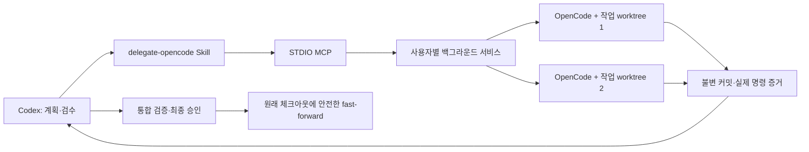

# Codex–OpenCode 위임 플러그인

Codex가 계획·작업 배분·검수·최종 보고를 맡고, OpenCode가 코드 작성·테스트·빌드를 수행하는 로컬 도구입니다. [Custom Agent Loop](https://github.com/youwonsock/custom-agent-loop-system)의 수정판이 아닙니다. 이 서비스에는 개발 계획을 생성하거나 실패 후 수정 방향을 결정하는 에이전트가 없습니다.



## 요구 사항

- Windows 또는 macOS, Node.js **22 이상**, Git, Codex CLI의 `plugin` 명령.
- OpenCode **1.18.30** 및 사용 가능한 공급자 인증. v1은 이 버전을 정확히 검사합니다. SDK도 동일 버전이며 의존성은 `package-lock.json`으로 고정합니다.
- 작업 대상은 이름 있는 브랜치가 체크아웃된 Git 저장소 루트여야 합니다. 추적 파일 수정과 미추적 소스 파일이 없어야 합니다. ignored 규칙·스펙은 `context_files`로 지정합니다.
- 기본 동시 실행 수 2, 시도 제한 시간 60분, 최초 시도 이후 수정 재시도 3회. 서비스 전체 제한은 `CODEX_OPENCODE_CONCURRENCY`, 실행별 제한은 `settings`로 지정합니다.

## 설치

```sh
git clone --branch codex/opencode-delegation https://github.com/youwonsock/tool-utility.git
cd tool-utility/codex-opencode
```

macOS:

```sh
sh install.sh
```

Windows PowerShell:

```powershell
./install.ps1
```

스크립트는 의존성을 설치하고 번들을 만든 다음 사용자 설치 폴더에 **독립 배포물**을 복사합니다. 그 설치본을 `codex plugin marketplace add`로 등록하고 `codex plugin add codex-opencode@personal`로 설치합니다. 이후 **새 Codex 대화**에서 다음과 같이 요청합니다.

> $delegate-opencode를 사용해 이 변경을 계획하고, 구현과 테스트를 OpenCode에 위임한 뒤 결과를 검수해 반영해줘.

개발 저장소를 옮기거나 삭제해도 설치본은 원본 경로나 `node_modules`를 참조하지 않습니다. Node.js·Git·OpenCode 실행 파일은 계속 설치되어 있어야 합니다. 소스 플러그인의 `runtime/`은 설치 때 채우므로 원본 폴더를 직접 등록하는 대신 설치 스크립트를 사용하세요.

등록 없이 배포물만 생성하려면 `sh install.sh --no-register` 또는 `./install.ps1 -NoRegister`를 사용합니다. 설치 결과 JSON에 실제 배포 경로와 CLI 경로가 표시됩니다.

## 저장 위치와 실행 수명

| 항목 | 기본 위치 |
| --- | --- |
| macOS 데이터 | `~/Library/Application Support/codex-opencode` |
| Windows 데이터 | `%LOCALAPPDATA%/codex-opencode` |
| 배포물 | 데이터 폴더의 `install/releases/<version>-<hash>` |
| 현재 설치 정보 | `install/current.json` |
| 실행 상태·저널 | `state.json`, `journal.jsonl` |
| 작업/검증 체크아웃 | `worktrees/<run-id>` |
| 워커 제어 기록·원본 로그 | `jobs/<attempt-id>` |
| 읽기 전용 증거 | `artifacts/<run-id>` |

`CODEX_OPENCODE_HOME`으로 데이터 위치, `CODEX_OPENCODE_INSTALL_ROOT`로 설치 위치를 변경할 수 있습니다. 둘 모두 개발 저장소 바깥을 권장합니다. 데이터·연결 암호·로그는 Git에 넣지 않습니다. POSIX에서는 디렉터리/인증 기록에 사용자 전용 권한을 설정하며 Windows는 사용자 프로필의 ACL을 사용합니다.

MCP가 처음 호출될 때 서비스가 시작됩니다. Codex 대화 종료나 MCP 연결 종료는 실행 취소가 아닙니다. 별도 워커 프로세스가 서비스 재시작에도 작업을 유지합니다. 컴퓨터 재부팅 후에는 재연결 시 프로세스·부팅 식별자·세션을 대조하며, 중단된 모델 요청을 자동으로 재전송하지 않습니다. OS 로그인 서비스나 Codex 자동 실행은 등록하지 않습니다.

## 작업 제출

전체 예제와 도구 계약은 [Skill 참조](plugins/codex-opencode/skills/delegate-opencode/references/contract.md)에 있습니다.

```json
{
  "request_id": "feature-001",
  "repo": "/absolute/project",
  "context_files": ["AGENTS.md", ".specs/feature/spec.md"],
  "tasks": [{
    "id": "parser",
    "goal": "명세에 따라 입력 파서를 구현한다.",
    "dependencies": [],
    "scope": ["src/parser/**", "test/parser.test.ts"],
    "acceptance": ["잘못된 입력은 정의된 오류로 반환한다"],
    "verification": [{"command": "npm test -- parser"}],
    "resources": []
  }],
  "final_verification": [{"command": "npm test && npm run build"}]
}
```

명령은 해당 플랫폼 OpenCode의 셸에서 실행됩니다. 수정 범위는 정확한 파일, `/`로 끝나는 폴더, `/**`로 끝나는 폴더 범위, 또는 전체 소스를 뜻하는 `**`입니다. 문맥 파일은 상대 경로와 해시를 보존하고 결과 커밋에서 제외합니다. 추적된 파일의 내용과 충돌하거나 문맥이 수정되면 실패합니다. 문맥 스냅샷은 제출 시 보관하고 실제 시작 시 원본 해시를 재확인합니다. 규칙 파일 자체를 수정하려면 해당 파일을 읽기 전용 문맥으로 등록하지 않는 별도 작업으로 계획해야 합니다.

모델은 OpenCode 설정, 최근 모델 기록, 설정된 공급자의 기본 모델 순서로 해석하고 시도 기록에 고정합니다. 명시한 모델이나 최근 모델이 사용 불가능하면 실패하며 다른 모델로 대체하지 않습니다. 작업의 `model: {providerID, modelID}`로 재정의할 수 있습니다. 수정 시도는 이전 시도의 모델을 유지합니다. `doctor`는 API와 모델 등록 상태를 검사하지만 **공급자 인증의 유효성은 실제 모델 요청에서 확인**됩니다.

## MCP 도구

| 도구 | 역할 |
| --- | --- |
| `doctor` | 설치·버전·OpenCode API·모델 선택·자원 등록 확인 |
| `submit_tasks` | 새 실행 생성 또는 기존 실행에 작업 추가 |
| `list_runs`, `get_run` | 실행 발견, 작업·검수·입력 대기 조회 |
| `wait_run` | 최대 30초 대기 후 이벤트 변경분 반환 |
| `get_artifact` | diff·실제 검증 결과·모델 보고·로그 페이지 조회 |
| `review_task` | 특정 시도와 커밋의 승인 또는 수정 지시 |
| `respond_to_request` | OpenCode 질문·권한 요청에 응답 |
| `reconcile_run` | 실제 프로세스·세션·Git 상태와 기록 대조 |
| `cancel_run` | 취소 요청 및 종료 확인 추적 |
| `validate_run` | 현재 통합 커밋·작업 버전·문맥·명령 고정 후 검증 |
| `finalize_run` | Codex 최종 승인으로 검증된 커밋 반영 |

변경 요청에는 `request_id`가 필요합니다. 같은 ID·내용은 기록된 응답을 반환하고 다른 내용은 거부합니다. 이전 요청의 실행 여부가 불확실하면 `REQUEST_UNCERTAIN`을 반환하므로 기록을 대조한 뒤 현재 상태에 맞는 다음 동작을 결정합니다.

기본 응답은 MCP JSON 포장을 포함해 4 KiB, 산출물 응답은 16 KiB 이내입니다. `next_cursor`, `after`, `next_offset`을 따라 조회합니다. 큰 구조화 응답은 JSON을 잘라내지 않고 전체 응답을 가리키는 `artifact_id`를 반환합니다. `get_artifact`로 해당 JSON 전체를 이어 읽을 수 있습니다. 모델의 요약과 관찰된 명령·종료 코드는 별도 필드입니다. `unknown`, 미실행, 중단은 성공으로 승인할 수 없습니다.

## 검수와 Git 반영

1. 독립 작업은 최대 동시 실행 수 안에서 실행합니다. 후속 작업은 선행 작업의 **검수·통합 완료**를 기다립니다.
2. OpenCode가 종료되고 프로세스 정지가 확인되면 범위와 문맥을 검사하고 불변 결과 커밋을 만듭니다.
3. Codex가 diff와 실제 명령 증거를 읽고 정확한 시도 ID·커밋으로 승인합니다. 통합 충돌은 증거와 함께 반환하며 Codex의 수정 지시를 기다립니다.
4. 모든 작업을 통합한 후 `validate_run`으로 별도 검증 worktree를 만듭니다. 검증 중 추가 제출은 차단하며 소스가 변경되면 검증을 실패 처리합니다.
5. 검증 산출물을 검수한 Codex가 현재 검증 ID·커밋·작업 버전으로 `finalize_run`을 호출합니다. 작업을 추가했다면 이전 검증은 무효입니다.
6. 원래 브랜치·기준 HEAD·소스 상태를 재확인하고 `git merge --ff-only --no-overwrite-ignore`로 반영한 뒤 실제 HEAD와 작업폴더를 확인합니다. 사용자 변경이나 ignored 파일 충돌을 자동 삭제·되돌림하지 않습니다.

통합된 작업은 수정하지 않고 후속 작업을 추가합니다. 아직 통합하지 않은 결과에 대한 수정 요청은 현재 통합 기준에 이전 결과 전체를 적용한 새 시도로 실행합니다.

## 공유 도구

기존 OpenCode 설정의 MCP 연결은 모두 비활성화하고 명시한 자원만 활성화합니다. 외부 OpenCode 플러그인은 `--pure`로 비활성화합니다. 사용자 인증 파일을 복제하지 않으므로 외부 인증 플러그인에 의존하는 공급자는 별도 호환성 확인이 필요합니다.

프로파일은 연결 설정, `resource_key`, 읽기 전용 probe 명령, 예상 인스턴스 ID를 포함합니다. probe는 실제 시스템을 조회하여 `instance_id`와 프로젝트 종속 도구라면 `project_path`를 JSON으로 반환해야 합니다. 기대값을 그대로 출력하는 스크립트는 운영용 확인 명령으로 사용할 수 없습니다. 잠금을 획득한 후 probe를 실행하며 불일치하면 모델을 호출하지 않습니다.

Unity Editor는 **작업 worktree와 최종 검증 worktree 각각**에 맞게 연결되어야 합니다. 필요한 프로젝트 경로는 실행 상태/오류에서 확인할 수 있습니다. 현재 체크아웃의 Editor가 자동 전환된다고 가정하지 않습니다. 동일 자원에는 항상 같은 `resource_key`를 사용하세요.

이 기능은 같은 서비스가 관리하는 작업을 직렬화합니다. 외부 사용자의 조작을 차단하는 OS 샌드박스가 아니며, Git worktree는 Editor·DB·셸의 외부 부작용을 격리하지 않습니다. worker의 내부 재위임과 이 위임 MCP 호출은 금지됩니다.

## 운영·업데이트

설치 출력 또는 `install/current.json`의 `cli` 경로를 사용합니다.

```sh
node "<installed-cli-path>" doctor "/absolute/project"
node "<installed-cli-path>" status
node "<installed-cli-path>" call get_run request.json
node "<installed-cli-path>" stop
node "<installed-cli-path>" stop --cancel
node "<installed-cli-path>" cleanup run_id
```

`stop`은 실행 중 작업이 있으면 거부합니다. `stop --cancel`은 먼저 취소를 요청하며, `cancelled`를 확인한 뒤 `stop`을 다시 호출합니다. 서비스 프로세스만 종료되더라도 별도 워커는 유지됩니다. `cleanup`은 완료/취소가 확정된 실행의 worktree만 제거하고 증거와 기록은 보존합니다. 기록 전체의 영구 삭제는 v1 자동 정리 범위에 포함하지 않습니다.

업데이트는 저장소를 갱신하고 설치 스크립트를 다시 실행합니다. 새 버전 폴더를 준비한 뒤 등록을 전환하며 이전 배포물은 삭제하지 않습니다. 프로토콜이나 저장 형식이 달라지면 `UPDATE_PENDING`으로 안내하고 실행 중 작업을 종료하지 않습니다. 자세한 복구 판단은 [운영 문서](docs/operations.md)에 있습니다.

## 개발과 검증

```sh
npm ci
npm run check
```

모의 OpenCode HTTP 서버와 실제 임시 Git 저장소·프로세스로 계약을 검증합니다. 전용 GitHub Actions는 Windows·macOS의 Node 22에서 타입 검사, 자동 테스트, 플러그인 검사를 실행합니다. 로컬 형식 검사는 `plugin-creator`와 `skill-creator`의 공식 검증기로도 수행했습니다. 수행 여부와 결과는 [PROGRESS.md](PROGRESS.md)에 기록합니다.

실제 모델 검증을 시작하려면 `npm run test:live`를 실행합니다. 임시 프로젝트와 병렬 작업 2개를 만들고 실행 ID를 출력합니다. 이 스크립트는 자동 승인하지 않습니다. Codex가 증거 검수 → 수정 요청 → 승인 → 통합 검증 → 최종 승인 순서로 이어가야 합니다. 실제 공급자 사용료가 발생할 수 있습니다.

구현 근거: [확정 스펙](docs/spec.md), [OpenCode 서버 API](https://opencode.ai/docs/server/), [OpenCode 설정](https://opencode.ai/docs/config/), [OpenCode 1.18.30 SDK](https://www.npmjs.com/package/@opencode-ai/sdk/v/1.18.30), [Codex 플러그인 문서](https://developers.openai.com/plugins/build/plugins).
